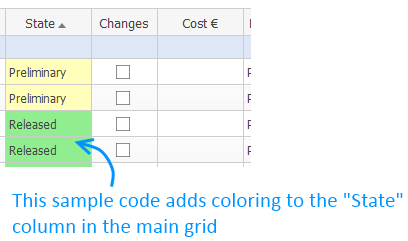
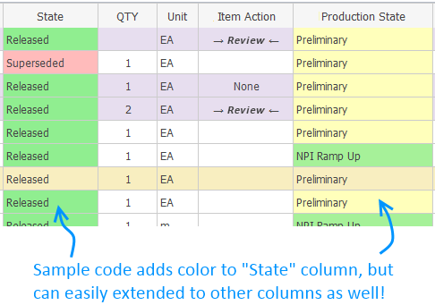

# Add color to main grid and impact matrix

## Description

This project demonstrates some simple ways to improve visibility and coloring in Aras.

## Project Details

#### Built Using:
Aras 11.0 SP11

#### Versions Tested:
Aras 11.0 SP11

#### Browsers Tested:
Internet Explorer 11, Chrome 66.0, Firefox ESR 52.7.4

## Usage

#### Important!
**Always back up your code tree and database before applying an import package or code tree patch!**

### Sample 1: Add background color to main grid
1. Create new Method and add sample code
2. Optional: Additional target columns or styling options can easily be added in the code
3. Add the Method in your target ItemType (e.g. Part) in tab **Server Events**
4. Use event **onAfterGet**

### Sample 2: Add background color to impact matrix
1. Open Method **Express ECO ImpactMatrixGrid**
2. Add state color in Impact Matrix by modifying RowClass around line 1603/1604
3. See more instruction in the code comments

## Contributing

1. Fork it!
2. Create your feature branch: `git checkout -b my-new-feature`
3. Commit your changes: `git commit -am 'Add some feature'`
4. Push to the branch: `git push origin my-new-feature`
5. Submit a pull request

## Credits

Created by @AngelaIp

## License

This project is published to Github under the Microsoft Public License (MS-PL). See the [LICENSE file](./LICENSE.md) for license rights and limitations.